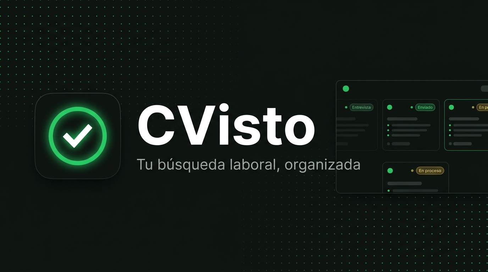

<p align="center">
  
</p>

<p align="center">
  <a href="#-funcionalidades"></a>
  <a href="#-tecnologías"></a>
  <a href="#-puesta-en-marcha-local"></a>
  <a href="LICENSE"></a>
  
</p>

---

## ¿Qué es CVisto?

**CVisto** es un espacio de trabajo personal para organizar búsquedas laborales. Centraliza postulaciones, empresas, contactos de RR. HH. y correos en un solo lugar — con sincronización de Gmail, clasificación inteligente por IA y recordatorios automáticos de seguimiento.

> El sistema **no reemplaza tus decisiones**: actúa como un asistente de gestión que organiza la información y automatiza tareas previamente autorizadas (como detectar respuestas, preparar seguimientos o sincronizar tu Gmail).

---

## ✨ Funcionalidades

<table>
<tr>
<td width="50%">

### 📬 Emails & Gmail
- **Sincronización automática** con Gmail (últimos 60 días, enviados y recibidos)
- **Lector de correos moderno** — HTML renderizado con padding interno, sin que el contenido toque los bordes
- Detección segura de imágenes (firmas, logos, embebidas, remotas) con toggle de visibilidad y lightbox
- Sanitización anti-XSS estricta en todos los correos renderizados
- **Responder / Reenviar** con asunto y cuerpo precargados
- Redacción con CC, adjuntos (hasta 18 MB) y autocompletado de contactos
- Filtros: texto libre, Todos / Recibidos / Enviados, rango de fechas, paginación (50/página)

</td>
<td width="50%">

### 🏢 Postulaciones & Empresas
- Alta, edición y borrado de postulaciones
- Estados: `pendiente`, `en_proceso`, `entrevista`, `oferta`, `aceptado`, `rechazado`, `cancelado`
- Vinculación automática de correos a postulaciones por empresa y contacto
- Clasificación de respuestas: **rechazo / entrevista / novedad / contacto**
- Distinción inteligente entre **alertas masivas de portales** (ignoradas) y **actualizaciones de tu candidatura** (procesadas)
- Empresas y **contactos de RR. HH.** con botón de email directo

</td>
</tr>
<tr>
<td width="50%">

### 🧠 Inteligencia Artificial (Gemini)
- Análisis de correos con **Gemini 2.5 Flash** — remitente, dominio, asunto, cuerpo, enlaces y adjuntos
- Control de concurrencia y **backoff exponencial con jitter** para manejar límites de cuota (429)
- Diagnóstico detallado de errores de API

</td>
<td width="50%">

### ⏱️ Estrategia de Contacto
- Lista de oportunidades que conviene contactar **ahora**
- Regla de **48 horas hábiles** (excluyendo fines de semana) para mover postulaciones sin respuesta a seguimiento urgente
- Renovaciones sugeridas con plantillas personalizables
- Si llega una respuesta, el estado se actualiza y la postulación sale de la cola automáticamente

</td>
</tr>
<tr>
<td width="50%">

### 📊 Dashboard & Analítica
- Estadísticas de actividad mensual
- Gráfico de emails enviados/recibidos y postulaciones activas
- Tasas de respuesta y estado general de la búsqueda

</td>
<td width="50%">

### 🔐 Autenticación & Configuración
- **Login con Google OAuth 2.0** — sin contraseñas guardadas
- Exportación de backup completo en JSON
- Firma digital (imagen base64 embebida en emails) con resolución automática de `cid:`

</td>
</tr>
</table>

---

## 🔄 Flujo de trabajo

```
Encontrar oportunidad
        ↓
Registrar empresa y contacto RR. HH.
        ↓
Registrar postulación
        ↓
Enviar postulación  ─────────────── Gmail API (o registro manual)
        ↓
Esperar respuesta   ←─ sincronización detecta respuestas automáticamente
        ↓
    ¿Respondieron?
   ┌──────┴──────┐
   │              │
  NO              SÍ
   │              │
  +48 hs hábiles  Actualizar estado → entrevista / rechazo / novedad
   ↓
  → Estrategia: lista de seguimiento urgente
   ↓
  Enviar seguimiento (con plantilla)
```

### Estados de postulación

| Estado | Descripción |
|---|---|
| `pendiente` | Registrada, aún no enviada |
| `en_proceso` | En evaluación por la empresa |
| `entrevista` | Convocado a entrevista |
| `oferta` | Oferta recibida |
| `aceptado` | Oferta aceptada |
| `rechazado` | Proceso cerrado negativamente |
| `cancelado` | Descartada manualmente |

---

## 🛠 Tecnologías

### Backend (`BackEnd/`)

| Herramienta | Uso |
|---|---|
| **Bun** ≥ 1.3 | Runtime y gestor de paquetes |
| **TypeScript** (modo estricto) | Lenguaje |
| **Express** | Framework HTTP |
| **Zod** | Validación de entrada y tipos |
| **Turso / SQLite** (`@libsql/client`) | Base de datos |
| **Google Auth Library** | OAuth 2.0 / Google |
| **jose** | Firmado y verificación de JWT |
| **Google Generative AI** | Clasificación de correos con Gemini 2.5 Flash |
| **Vitest + Supertest** | 192 tests unitarios e integración |
| **ESLint / Prettier** | Lint y formato |

### Frontend (`FrontEnd/cvisto/`)

| Herramienta | Uso |
|---|---|
| **React 19** | UI |
| **Vite 6** | Bundler y dev server |
| **Tailwind CSS 4** | Estilos (tema dark, skeuomorfismo moderno) |
| **lucide-react** | Iconos |
| **motion** | Animaciones |
| **Zod** | Schemas compartidos |

### Integraciones

- **Google OAuth 2.0**: autenticación sin contraseñas.
- **Gmail API**: sincronización bidireccional, envío real (CC + adjuntos multipart), resolución de imágenes `cid:` embebidas.
- **Gemini AI**: análisis y clasificación de correos con control de concurrencia y resiliencia a errores de cuota.

---

## 📁 Estructura del proyecto

```
.
├── docs/                     → imágenes y recursos del README
├── BackEnd/
│   ├── src/
│   │   ├── config/           → env (Zod), cliente Turso, credenciales Google
│   │   ├── controllers/      → entrada y salida HTTP
│   │   ├── services/         → lógica de negocio (Gmail, IA, sincronización, estrategia…)
│   │   ├── models/           → acceso a datos (queries parametrizadas)
│   │   ├── routes/           → rutas Express
│   │   ├── schemas/          → validación Zod por entidad
│   │   ├── middlewares/      → autenticación, errores, logger, validación
│   │   ├── types/            → tipos compartidos, enums y filas de tablas
│   │   └── utils/            → horas hábiles, JWT, migraciones, docs
│   ├── database/             → schema.sql (DDL) y seeds.sql
│   ├── scripts/              → migrate.ts
│   └── tests/                → suites Vitest (SQLite local, 192 tests)
│
└── FrontEnd/
    └── cvisto/
        ├── src/
        │   ├── components/   → vistas, modales, EmailViewer y librería UI
        │   ├── hooks/        → useAuth, usePostulaciones, useEmails…
        │   ├── lib/          → cliente API, html.ts (sanitización), helpers
        │   ├── schemas/      → schemas Zod del frontend
        │   └── types/        → tipos de la aplicación
        └── public/
            ├── logo.svg      → logo con checkmark
            └── favicon.svg
```

### Arquitectura del backend

```
HTTP Request
     ↓
Middleware  → autenticación JWT, validación Zod, logger
     ↓
Controller  → parsing y respuesta HTTP
     ↓
Service     → lógica de negocio y reglas de dominio
     ↓
Model       → queries parametrizadas a SQLite
     ↓
Turso / SQLite
```

---

## 🚀 Puesta en marcha local

### Requisitos

- **Bun** ≥ 1.3
- **Node.js** ≥ 18 (para el frontend con Vite)
- Credenciales de Google Cloud (OAuth 2.0 + Gmail API habilitado)
- Base de datos Turso (o SQLite local con `file:./db.sqlite`)

### 1. Backend (`BackEnd/`)

```bash
# 1. Copiar y completar las variables de entorno
cp .env.example .env
# Variables requeridas:
#   URL_TURSO, TOKEN_TURSO  → base de datos Turso
#   GOOGLE_CLIENT_ID, GOOGLE_CLIENT_SECRET, GOOGLE_CALLBACK_URL
#   JWT_SECRET              → clave larga y aleatoria
#   GEMINI_API_KEY          → Google AI Studio
#   GEMINI_MODEL            → (opcional) default: gemini-2.5-flash

# 2. Instalar dependencias y aplicar migraciones
bun install
bun run migrate

# 3. Levantar el servidor (http://localhost:3000)
bun run dev
```

### 2. Frontend (`FrontEnd/cvisto/`)

```bash
# 1. Instalar dependencias
bun install   # o: npm install

# 2. Configurar API URL en .env
echo "VITE_API_URL=http://localhost:3000" > .env

# 3. Levantar la app (http://localhost:5173)
bun run dev   # o: npm run dev
```

### Scripts útiles

| Comando | Directorio | Descripción |
|---|---|---|
| `bun run migrate` | `BackEnd/` | Aplica schema y seeds |
| `bun run test` | `BackEnd/` | 192 pruebas (Vitest) |
| `bun run typecheck` | `BackEnd/` | Chequeo de tipos |
| `bun run lint` | `BackEnd/` | ESLint |
| `bun run dev` | `FrontEnd/cvisto/` | Dev server (Vite) |
| `bun run build` | `FrontEnd/cvisto/` | Build de producción |

---

## 🧪 Tests

El backend cuenta con **192 tests** cubriendo:

- Autenticación (OAuth, JWT)
- CRUD de empresas, contactos, postulaciones, emails, seguimientos
- Estrategia de contacto y regla de 48 horas hábiles
- Sincronización de Gmail y clasificación de respuestas por IA
- Envío de correos reales (CC, adjuntos multipart)
- Renovaciones por plantilla y análisis determinístico de portales

Los tests corren contra una base **SQLite local** para no afectar la base remota.

```bash
# En BackEnd/
bun run test
# → Test Files  21 passed (21)
# →      Tests  192 passed (192)
```

---

## 📄 Licencia

Licenciado bajo la **GNU General Public License v3.0**. Ver [`LICENSE`](LICENSE).